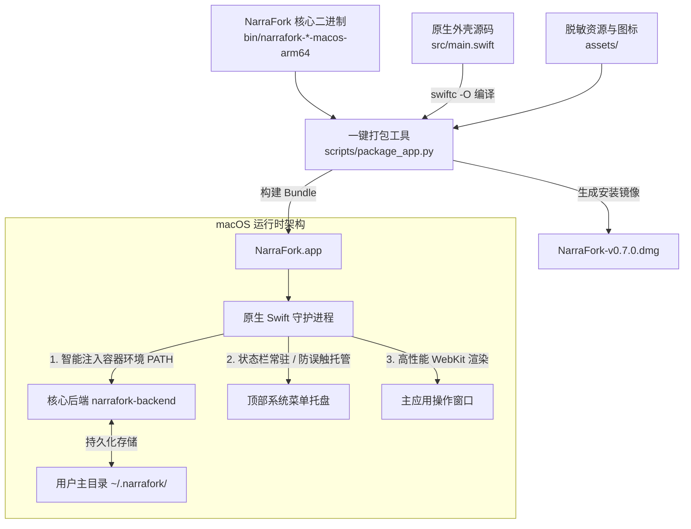

<div align="center">


# NarraFork macOS Launcher
### 原生 macOS 桌面启动器与一键自动化打包工具链

[](https://apple.com)
[](https://github.com)
[](https://swift.org)
[](https://python.org)
[](LICENSE)
[](https://github.com)
[](https://github.com)
[](#-设计美学与-dmg-镜像)

<p align="center">
  <b>让 NarraFork 摆脱终端与浏览器标签束缚，获得纯粹的 macOS 原生桌面体验与企业级分发能力。</b>
</p>

[功能特性](#-核心功能特性) • [架构原理](#-架构与工作流) • [快速开始](#-快速开始与打包) • [目录结构](#-目录结构) • [常见问题](#-常见问题与故障排查-faq) • [版权声明](#-版权与归属声明) • [开源协议](#-开源协议)

</div>

---

## 📖 项目简介

**NarraFork** 是一款以「叙事分叉」为核心设计理念的 AI 协作编程平台。然而在 macOS 上以传统方式使用官方二进制文件时，开发者往往面临诸多痛点：
- ❌ **容易误触退出**：在终端运行二进制或浏览器标签中操作，关闭窗口就会导致后台服务意外中断；
- ❌ **环境变量丢失**：macOS GUI 应用程序默认不继承用户的登录终端（如 `.zshrc` / `.bash_profile`）的环境变量，导致客户端经常报错“未检测到 Podman / Docker / OrbStack / Homebrew 环境”；
- ❌ **数据库迁移闪退**：全新设备初次初始化时容易因数据库迁移版本差（如 Drizzle migration）导致启动闪退；
- ❌ **更新维护繁琐**：在线更新后由于找不到解压后的二进制路径，无法快速更新到主程序中；
- ❌ **分发体验简陋**：缺乏官方级精美 DMG、原生图标、防误触菜单栏托盘与一键自动化部署脚本。

**NarraFork macOS Launcher** 为此而生。本项目提供了一整套**原生 Swift 外壳**与**全自动图形化/命令行打包流水线**，将 NarraFork 核心二进制一键封装为符合 Apple 人机交互规范（HIG）的高性能 macOS 原生桌面客户端（`.app`）与精美中文 `.dmg` 安装镜像。

---

## ✨ 核心功能特性

### 🍎 1. AppKit + WebKit 原生轻量架构
* **告别 Electron 冗余**：采用纯原生 Swift + Cocoa + WebKit 开发，内存占用极低，毫秒级冷启动；
* **顺滑交互**：完整支持 macOS 原生触控板双指缩放、平滑手势滚动、全键盘快捷键（撤销/重做/复制/粘贴/强制刷新/全屏）。

### 🛡️ 2. 状态栏常驻守护与防误触关闭
* **防误触机制**：点击主窗口左上角的“红叉”关闭按钮时，应用将**平滑隐藏至屏幕顶部系统状态栏**，核心后台进程持续稳定运行，绝不中断正在进行的任务；
* **菜单栏快捷控制**：支持通过顶部状态栏图标一键呼出/隐藏主界面、在默认浏览器中打开、平滑热重启核心服务、或安全彻底退出。

### ⚡ 3. 智能开发环境全息注入（容器与 CLI 零配置识别）
* **深度打通环境壁垒**：原生加载器在拉起核心后端时，自动智能探测并合并以下路径至系统的 `PATH`：
  - `/opt/homebrew/bin` & `/opt/homebrew/sbin` (Apple Silicon Homebrew)
  - `/usr/local/bin` & `/usr/local/sbin` (Intel Homebrew)
  - `~/.local/bin` / `~/.cargo/bin` / `~/.nvm/versions/node/...`
  - `~/.orbstack/bin` / `/usr/local/podman/bin`
* **无感知兼容**：无需从终端通过 `open` 启动，直接双击 App 即可完整识别宿主机的 **Podman、Docker、OrbStack、Git、Node** 等工具链。

### 🔄 4. 自动无缝热更新接管
* **原地无损热替换**：客户端原生监听应用内的更新信号。在界面点击“下载新版本”后，仅需点击状态栏中的「重启核心服务」（或重启 App），加载器会自动在后台将最新下载的核心文件原子替换进 App Bundle，无需重新手动打包！

### 🌐 5. 灵活的网络与启动设置（IP 与端口自定义绑定）
* **状态栏直观配置**：状态栏实时显示当前监听地址与端口（如 `启动设置 (0.0.0.0:7788)...`），点击即可呼出原生配置面板，亦支持快捷键 `Cmd+,`；
* **局域网设备互联**：支持自定义绑定 `0.0.0.0`，允许同一 Wi-Fi 下的 iPad / iPhone 等移动设备直接访问 Mac 端 NarraFork 核心服务；亦可绑定 `127.0.0.1` 仅限本机安全使用；
* **灵活端口指定与安全平滑重启**：支持自定义指定端口号（1024 - 65535），保存后启动器自动释放旧端口并平滑重启核心；提供「恢复默认 (0.0.0.0 : 7788)」一键还原保障。

### ⏪ 6. 顶部状态栏一键核心版本回退与切换 (Rollback Safety)
* **防翻车机制**：当在线更新或升级到新版本出现 BUG、数据库不兼容或意外异常时，无需重新打包或寻找老文件；
* **菜单栏快速回退**：点击屏幕顶部状态栏的「核心版本回退与切换」，即可在下拉列表中直观查看所有已归档版本（如 `v0.7.2`、`v0.7.0`、`v0.6.6` 等），一键点击平滑回退并秒级重启；
* **数据库自动快照保障**：每次执行版本回退或切换前，系统会自动为当前数据库生成带时间戳的安全备份快照（`narrafork.db.bak_switch_*`），彻底消除回退时的后顾之忧；
* **外部版本导入与目录管理**：支持点击「📥 导入其他版本核心...」直接录入任何官方历史核心，或一键打开 `~/.narrafork/versions/` 版本归档目录。

### 💾 7. 纯净零迁移模版与数据绝对隔离
* **免除历史迁移 BUG**：内置全量通过迁移验证的纯净脱敏数据库模版（`template_narrafork.db`），彻底规避新用户设备首次启动时的数据库迁移异常；
* **应用与数据解耦**：所有用户项目、工作区、配置文件和个人数据库 100% 独立保存在用户的个人主目录（`~/.narrafork/`），应用本体为纯净无状态外壳，随时可安全升级、覆盖或重装。

### 🎨 8. 纯中文与 iOS 超椭圆设计 DMG 安装包
* **iOS 超椭圆连续曲率**：图标严格遵循 Apple iOS 官方超椭圆（Continuous Squircle，22.37% G2 曲率）与 1.5px 顶光微反光倒角，彻底去除桌面图标的“白底方块”；
* **专业级 Retina 中文 DMG**：自动生成 1320×800 Retina @2x 高清暗黑毛玻璃背景、曜青科技导向箭头、拖拽至 `/Applications` 软链接以及贴心的中文放行提示。

---

## 🏗️ 架构与工作流



---

## 📁 目录结构

```text
narrafork/
├── 一键打包App.command         # 双击即可运行的双击打包脚本（交互式 GUI）
├── assets/                     # 高清图像、脱敏数据库与构建资产
│   ├── AppIcon.icns            # 多分辨率 iOS 连续超椭圆 macOS 原生图标
│   ├── NarraFork_1024.png      # 1024x1024 Retina 高清透明背景图标
│   ├── dmg_background.png      # 1320x800 Retina 暗黑科技风 DMG 背景
│   ├── template_narrafork.db   # 纯净零数据数据库模版（含 170 迁移标记）
│   ├── 安装使用必读.txt         # 打包进 DMG 的用户首次安装指南
│   └── NarraFork_wrapper       # 预编译好的原生 ARM64 外壳（免编译环境）
├── bin/                        # 官方核心服务端二进制存放目录（已 gitignore）
│   ├── .gitkeep
│   └── README.md               # 核心放置与获取说明
├── dist/                       # 打包输出目录（已 gitignore）
│   └── .gitkeep
├── scripts/                    # 打包构建工程脚本
│   └── package_app.py          # 支持 GUI 弹窗选择与 CLI 批处理的打包核心
├── src/                        # 原生外壳源码
│   └── main.swift              # Swift + AppKit + WebKit 原生外壳与环境守护
├── LICENSE                     # MIT 开源协议
└── README.md                   # 项目说明文档
```

---

## 🚀 快速开始与打包

### 前置环境准备

1. **操作系统**：macOS 12.0 (Monterey) 或更高版本（原生适配 Apple Silicon M1/M2/M3/M4 系列及 Intel）；
2. **Python 运行环境**：macOS 自带或 Homebrew 安装的 `python3`（需包含 `tkinter` 与 `Pillow`）：
   ```bash
   pip3 install pillow
   ```
3. **DMG 生成工具（可选，若需生成 .dmg）**：
   ```bash
   brew install create-dmg
   ```

---

### 第一步：准备 NarraFork 核心文件

将官方发布的 macOS 核心可执行文件拷贝至本项目的 `bin/` 目录中：
- **Apple Silicon (M系列)**：`bin/narrafork-*-macos-arm64`
- **Intel 芯片 (x86_64)**：`bin/narrafork-*-macos-x64`

```bash
# 拷贝对应架构核心至 bin/ 目录
cp /path/to/narrafork-*-macos-arm64 bin/   # 适用于 M1/M2/M3/M4 系列
cp /path/to/narrafork-*-macos-x64 bin/     # 适用于 Intel 系列 Mac
```
*(打包器也支持自动检测本地 `~/Downloads` 或历史 App 内下载的更新核心)*

---

### 第二步：一键打包

#### 方式 A：GUI 可视化打包（推荐，最省心）
直接双击项目根目录下的 **`一键打包App.command`**。
* 程序会自动弹出清爽的中文打包面板；
* 自动识别核心芯片架构（**Apple Silicon arm64** 或 **Intel x64**）；
* 勾选打包选项（覆盖安装到系统应用、更新桌面快捷方式、生成对应架构的中文 DMG）；
* 点击 **🚀 开始一键打包 NarraFork.app**，数秒内即可完成！

#### 方式 B：终端命令行打包（支持双架构与自动化流水线）
```bash
# 1. 基础打包（自动识别二进制架构）：
python3 scripts/package_app.py --cli bin/narrafork-0.7.2-macos-arm64

# 2. 指定为 Intel (x64) 芯片打包：
python3 scripts/package_app.py --arch x64

# 3. 双架构全量构建（一键同时输出 arm64 与 x64 两款独立安装包）：
python3 scripts/package_app.py --arch all
```

---

## 💡 产物输出与分发

打包完成后，在 `dist/` 目录下将生成两个关键产物：
1. **`dist/NarraFork.app`**：
   - 完整的 macOS 原生应用程序 Bundle；
   - 原生外壳基于 **Universal 2** 双架构编译，原生无缝适配 Apple Silicon 与 Intel 芯片；
   - 已完成本地自签名（`codesign`）并清理安全隔离属性；
   - 包含官方 Logo、防误触状态栏常驻特性、内嵌脱敏纯净数据库。
2. **`dist/NarraFork-v<版本>-macOS-arm64.dmg` / `dist/NarraFork-v<版本>-macOS-x64.dmg`**：
   - 对应芯片架构专属定制的精美中文 DMG 安装镜像；
   - 打开后呈现左侧 App、右侧 Applications、中间导向箭头与底部《安装使用必读.txt》；
   - 可直接通过网盘、GitHub Release 或 AirDrop 分享给其他 Mac 用户。

---

## ❓ 常见问题与故障排查 (FAQ)

### Q1: 其他用户打开 DMG 安装后，提示“无法验证开发者”或“已损坏”？
> **原因**：由于本地自签名应用未向 Apple 支付年费进行公证（Notarization），macOS Gatekeeper 会弹出安全拦截。
>
> **解决方法（任选其一，仅需操作一次）**：
> 1. **右键打开法（推荐）**：在「访达」的「应用程序」目录中，按住 `Control` 键（或右键）点击 NarraFork 图标，点击「打开」，并在弹窗中再次点击「打开」；
> 2. **终端放行命令**：打开系统终端，运行以下命令清除隔离属性：
>    ```bash
>    xattr -cr /Applications/NarraFork.app
>    ```

### Q2: 客户端依然检测不到我的 Podman 或 OrbStack？
> **检查方式**：
> 1. 确认已安装好 Podman Desktop 或 OrbStack，且在终端中运行 `podman --version` 或 `docker --version` 正常；
> 2. 本客户端已默认注入了常见路径。若您使用了非标准路径，可在 `~/.narrafork/settings.json` 中配置自定义环境，或确认工具链软链接位于 `/usr/local/bin` 或 `/opt/homebrew/bin` 下。

### Q3: 端口 7788 被占用怎么办？
> 如果本地有其他实例正在运行，点击顶部菜单栏 NarraFork 图标选择「退出」，或在终端运行：
> ```bash
> lsof -i :7788
> killall NarraFork narrafork-backend
> ```

---

## 🤝 贡献与建议

欢迎提交 Pull Request 或 Issue 共同完善 macOS 客户端体验！
- 发现新版本布局适配问题？
- 有更好的状态栏快捷菜单建议？
- 欢迎提交 PR 参与共建！

---

## ⚖️ 版权与归属声明 (Copyright & Attribution)

本工程包含两部分独立的版权与归属划分，请知悉并遵守相关权利：

1. **NarraFork macOS 启动器与桌面增强工具链 (NarraFork macOS Launcher & Toolkit)**：
   * **制作与维护**：由 **Davis** 独立制作、架构设计与开源维护；
   * **涵盖范围**：包含原生 Swift 应用外壳 (`src/main.swift`)、顶部状态栏常驻守护与防误触机制、环境全息穿透注入管线、交互式与自动化打包流水线 (`scripts/package_app.py`) 以及超宽无缝自适应 DMG 设计资产；
   * **开源授权**：基于 [MIT License](LICENSE) 开源协议完全免费开放。

2. **NarraFork 核心本体与品牌 (NarraFork Core & Official Brand)**：
   * **所有权归属**：**NarraFork** 平台、核心服务及官方品牌资产完全属于 **NarraFork 团队**（NarraFork Team）所有；
   * **涵盖范围**：包含 NarraFork 核心后端二进制（Bun/Node 运行时）、前端交互逻辑拓扑、官方产品标识与相关知识产权；
   * **致谢**：本项目作为第三方非官方 macOS 原生桌面级客户端封装方案，旨在为广大 macOS 开发者提供极致顺滑、持久运行的原生体验，由衷致敬并感谢 NarraFork 团队打造了如此杰出的 AI 协作平台！

---

## 📄 开源协议

* 本 NarraFork macOS Launcher 原生外壳及打包工具链采用 [MIT License](LICENSE) 协议开源。
* 任何衍生使用均需保留原作者 **Davis** 及 **NarraFork 团队** 的版权与致谢声明。
