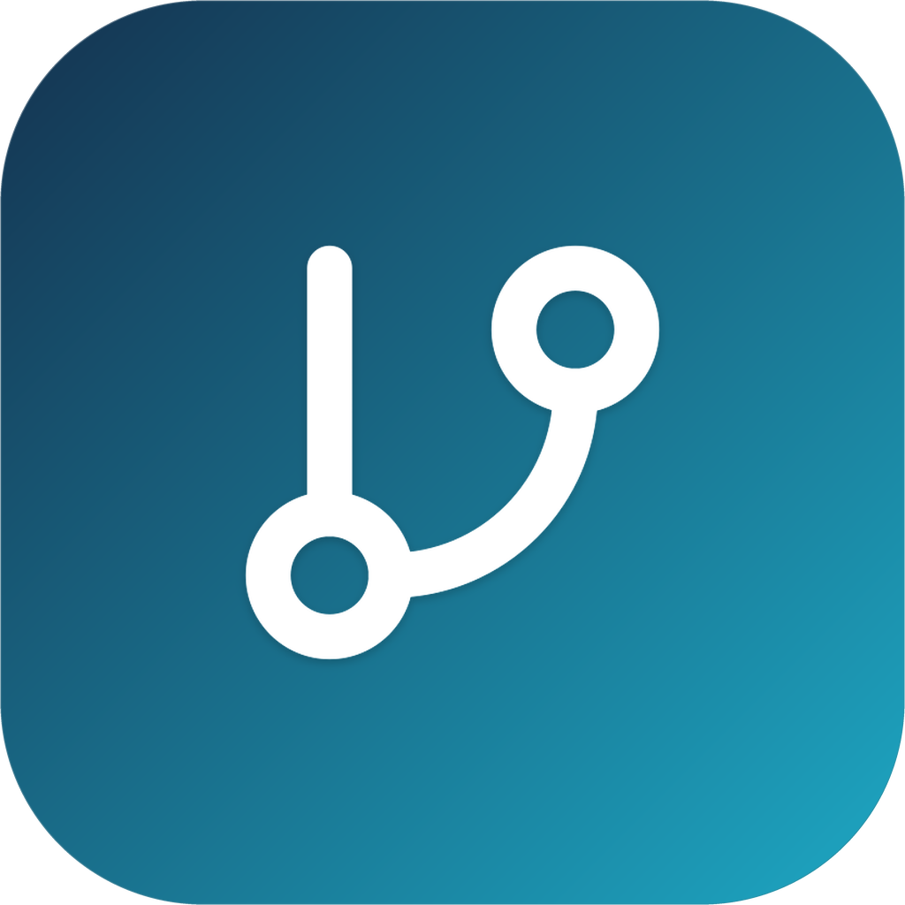

<div align="center">



# NarraFork macOS Launcher
### Native macOS Desktop Launcher & 1-Click Automated Packaging Toolchain

[](https://apple.com)
[](https://github.com)
[](https://swift.org)
[](https://python.org)
[](LICENSE)
[](https://github.com)
[](https://github.com)
[](#-dmg-and-visual-design)

<p align="center">
  <b>Elevate NarraFork from terminal sessions and browser tabs to a first-class macOS desktop experience with production-grade distribution capabilities.</b>
</p>

[Features](#-key-features) • [Architecture](#-architecture--workflow) • [Quick Start](#-quick-start--packaging) • [Directory Layout](#-project-structure) • [FAQ](#-faq--troubleshooting) • [Copyright](#-copyright--attribution) • [License](#-license)

</div>

---

## 📖 Overview

**NarraFork** is an AI-assisted collaborative coding platform built around branching exploration. Running standalone server binaries on macOS, however, presents distinct developer hurdles:
- Accidental closures of terminal tabs kill the backend process;
- Standard macOS GUI apps do not inherit user shell profiles (`.zshrc`), causing container environments (OrbStack, Podman, Docker) to remain undetected;
- New database schema migrations (such as Drizzle ORM) can trigger startup panics on clean installs;
- In-app updates leave binaries hidden in deep resource paths without in-place replacement;
- Lack of a polished native macOS DMG installer, Apple status bar menu, and one-click packaging.

**NarraFork macOS Launcher** solves these challenges with a **native Swift wrapper** and an **automated GUI/CLI packaging suite**, producing codesigned, stateful-isolated macOS application bundles (`.app`) and Retina `.dmg` installers following Apple's Human Interface Guidelines.

---

## ✨ Key Features

### 🍎 1. Native Lightweight AppKit + WebKit Shell
* **Zero Electron Overhead**: Built purely with Swift and WebKit. Starts in milliseconds with minimal RAM and CPU footprints.
* **Trackpad & Gestures**: Supports native macOS pinch-to-zoom, inertial scrolling, and standard shortcuts (`Cmd+Z`, `Cmd+R`, `Cmd+Shift+R`, full-screen).

### 🛡️ 2. Status Bar Resident Daemon & Accidental-Close Guard
* **Close-to-Tray**: Clicking the red window close button minimizes the window to the macOS top menu bar without killing background tasks.
* **Menu Bar Control**: Quick actions to bring to front, open in default browser, hot-restart the backend process, or safely terminate.

### ⚡ 3. Automatic Shell Environment Injection
* Injects Homebrew (`/opt/homebrew/bin`, `/usr/local/bin`), OrbStack (`~/.orbstack/bin`), Podman, Docker, Node, and Python into the backend execution context.
* Containers and local CLI tools are detected immediately without needing to launch from terminal.

### 🔄 4. In-Place Hot-Update Engine
* Watches update markers generated by NarraFork's web frontend. Upon downloading a new version, a simple restart via the status bar automatically swaps the new binary into the app bundle.

### 💾 5. Clean Migration Database & Zero Data Leakage
* Ships with a validated, zero-user database template (`template_narrafork.db`) to bypass Drizzle migration conflicts on fresh setups.
* User workspaces, projects, and configs live strictly in `~/.narrafork/`. The application bundle remains stateless and safe to upgrade.

### 🎨 6. iOS Continuous Squircle & Retina DMG Installer
* Volume and app icons feature Apple's 22.37% G2 continuous curvature with 1.5px bevel highlights, eliminating white square artifacts on desktop wallpapers.
* Builds customized 1320×800 Retina DMGs with dark mode frosted glass cards and drag-to-Applications installation links.

---

## 🚀 Quick Start & Packaging

### Prerequisites
1. **macOS 12.0+** (Apple Silicon M1-M4 & Intel);
2. **Python 3.9+** with Tkinter and Pillow:
   ```bash
   pip3 install pillow
   ```
3. **`create-dmg`** (optional, for DMG generation):
   ```bash
   brew install create-dmg
   ```

---

### Step 1: Place the NarraFork Core Binary
Place your macOS NarraFork core executable (e.g., `narrafork-0.7.0-macos-arm64`) into `bin/`:
```bash
cp /path/to/narrafork-0.7.0-macos-arm64 bin/
```

---

### Step 2: 1-Click Packaging

#### GUI Workflow (Recommended)
Double-click **`一键打包App.command`** in the project root:
* Inspect detected binaries and version info;
* Choose deployment options (Applications directory, Desktop shortcut, DMG installer);
* Click **🚀 开始一键打包 NarraFork.app**.

#### CLI Workflow (Automation / CI)
```bash
python3 scripts/package_app.py --cli bin/narrafork-0.7.0-macos-arm64
```

---

## ❓ FAQ & Troubleshooting

### Q1: macOS Gatekeeper reports "Developer Cannot Be Verified" or "Damaged"?
> **Solution**: Local ad-hoc codesigning requires a one-time Gatekeeper allowance:
> 1. **Right-Click Open**: In `/Applications`, hold `Control` and click `NarraFork`, then select `Open`;
> 2. **Terminal Bypass**:
>    ```bash
>    xattr -cr /Applications/NarraFork.app
>    ```

### Q2: Port 7788 is occupied?
> Terminate existing instances using the menu bar icon, or run:
> ```bash
> killall NarraFork narrafork-backend
> ```

---

## ⚖️ Copyright & Attribution

This repository clearly delineates the scope of copyright ownership:

1. **NarraFork macOS Launcher & Desktop Toolchain**:
   * **Author & Maintainer**: Crafted, designed, and maintained by **Davis**;
   * **Scope**: Includes the native Swift AppKit/WebKit wrapper (`src/main.swift`), menu bar daemon, environment injection mechanism, packaging automation scripts (`scripts/package_app.py`), and ultra-wide seamless adaptive DMG design assets;
   * **License**: Fully open source under the permissive [MIT License](LICENSE).

2. **NarraFork Core Platform & Official Brand**:
   * **Ownership**: **NarraFork** platform, core backend services, and official brand assets belong to the **NarraFork Team**;
   * **Scope**: Includes the core backend runtime binaries, product architecture, frontend web assets, and official branding;
   * **Acknowledgements**: This project serves as an optimized native desktop wrapper designed to provide developers with a refined, battery-efficient macOS native experience. Sincere thanks to the NarraFork Team for building such a wonderful AI collaborative platform!

---

## 📄 License

* The native macOS wrapper and packaging toolchain are licensed under the [MIT License](LICENSE).
* Any derivative distributions should retain copyright and attribution notices to **Davis** and the **NarraFork Team**.
